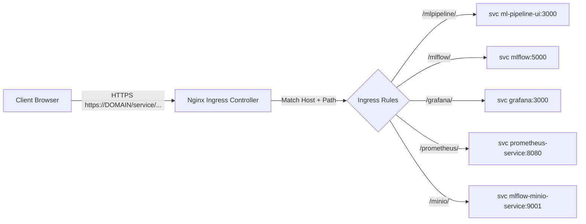
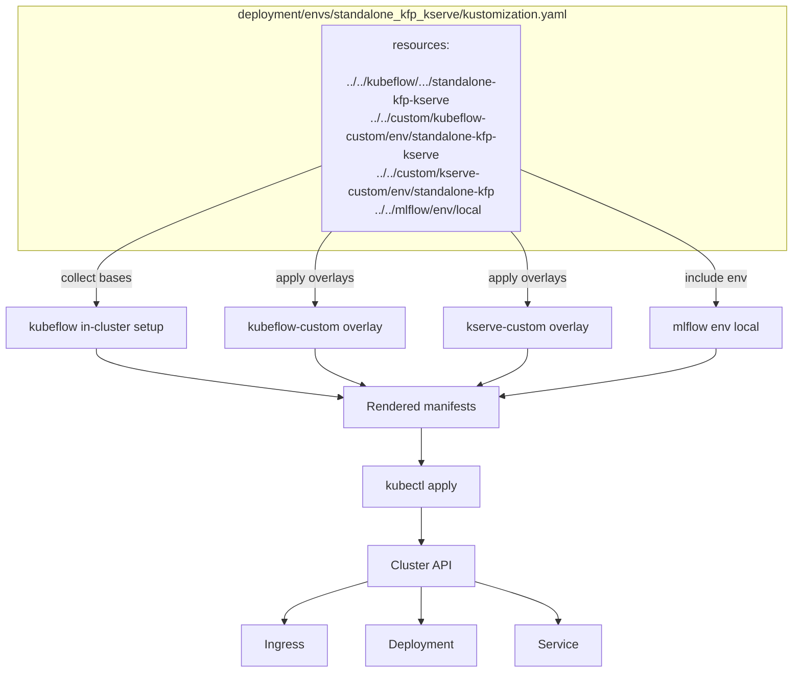

# Guide to Endpoints and Nginx Ingress

This guide explains how external access to platform services is managed via Nginx Ingress Controller and how each major service (Kubeflow, MLflow, Grafana, Prometheus, Minio) is exposed. It references the ingress resources defined in this repository. While https is briefly touched upon in some parts of this document, more details on it's functionality on this platform can be found in the [https folder](https).

## Nginx role and functionality in the platform cluster

The MLOps platform uses an Nginx Ingress Controller to route external http(s) traffic to internal Kubernetes services as pictured in the Nginx flow overview diagram below. 

#### Traffic flow overview

Nginx Ingress Controller runs as pods in the cluster and watches the Kubernetes API for `Ingress` objects. When you apply or update an Ingress, the controller reconciles configuration and updates its internal Nginx config dynamically.

Ingress objects are applied automatically during the platform install when [`setup.sh`](setup.sh) runs `kustomize build` against the chosen environment under [`deployment/envs/<option>`](deployment/envs/) and then `kubectl apply -f` the rendered manifests. The chosen environment referred here is the same as the ones under [setup.md, deployment options](setup.md#deployment-options). A more detailed explanation of this is process is below in chapter [Kustomize aggregation](#kustomize-aggregation). See also [setup.md](setup.md) for more details of the setup process as a whole. 

## Kustomize aggregation

Kustomize is a Kubernetes-native configuration management tool (integrated part of kubectl, the Kubernetes command-line tool). It lets you customize Kubernetes YAML without copying and modifying the original manifests. Instead of templating, it uses a patch-based and declarative approach. The install aggregates manifests via Kustomize from the selected environment overlay. This process includes the creation of ingress objects which are referred to as resources in the aggregation tree.

The diagram below visualizes the process in the case of [deployment/envs/standalone-kfp-kserve/kustomization.yaml](deployment/envs/standalone-kfp-kserve/kustomization.yaml).

:exclamation: Due to mermaid syntax issues the topmost path in the diagram below is incorrect (deployment/envs/standalone_kfp_kserve/kustomization.yaml). It should be deployment/envs/standalone-kfp-kserve/kustomization.yaml. :exclamation:

#### Kustomize resource aggregation from base manifests, overlays and environment files

### How patches and overlays work here

The base manifests are system-agnostic: placeholders like `DOMAIN` and `PLACEHOLDER` keep the repository portable across environments (local kind, cloud, different DNS names/issuers). In other words, bases provide upstream, reusable manifests. Overlays customize those bases for the chosen environment. This composition ensures base manifests stay portable, while env overlays inject the exact values and adjustments needed.

In the case of standalone-kfp-kserver (same as the diagram above), the env file [`deployment/envs/standalone-kfp-kserve/kustomization.yaml`](deployment/envs/standalone-kfp-kserve/kustomization.yaml) aggregates:
  - [`../../kubeflow/manifests/in-cluster-setup/standalone-kfp-kserve`](deployment/kubeflow/manifests/in-cluster-setup/standalone-kfp-kserve/kustomization.yaml) (base Kubeflow + KServe setup).
  - [`../../custom/kubeflow-custom/env/standalone-kfp-kserve`](deployment/custom/kubeflow-custom/env/standalone-kfp-kserve/) (overlay tailoring Kubeflow for this env).
  - [`../../custom/kserve-custom/env/standalone-kfp`](deployment/custom/kserve-custom/env/standalone-kfp/) (overlay tailoring KServe for standalone KFP).
  - [`../../mlflow/env/local`](deployment/mlflow/env/local/) (environment-specific MLflow configs).

These in turn can contain additional resources.

## Path-based routing and rewrites

As the http(s) request comes from a client browser into the nginx ingress controller, it is sometimes transformed at the ingress in order to reach the requested service and enable the service's internal functions to work correctly.

- Example: Client browser requests `https://DOMAIN/mlpipeline/` → nginx ingress controller receives the request and forwards it to kubeflow pipeline as `/`.

These transformations can affect the inner workings of a service/application which can be very application specific. If something isn't working, the ingress rules modifying these are a good place to take a look at. See under the heading [Ingress rules](#ingress-rules) for more details.

## Ingress rules

Here are some of the rules used in this project. See also online [NGINX Ingress Controller documentation](https://docs.nginx.com/nginx-ingress-controller/configuration/ingress-resources/basic-configuration/) for up to date details and more instructions on it's usage.

- Pattern: `/service(/|$)(.*)`
  - `/service` is the base prefix.
  - `(/|$)` matches either a trailing slash or the end of the path, ensuring both `/service` and `/service/` match.
  - `(.*)` captures the remainder of the request path, which becomes regex group `$2` for rewrite.
    - Needs to have `annotations:
    nginx.ingress.kubernetes.io/use-regex: "true"` for regex to work.
  

- Rewrite: `nginx.ingress.kubernetes.io/rewrite-target: /$2`
  - This removes the `/service` prefix before forwarding to the backend, so a request to `/mlflow/experiments` becomes `/experiments` at the MLflow service.
  - Benefits: Host multiple apps behind a single domain under distinct subpaths without requiring the app to be aware of the prefix.
  - Example translations:
    - `https://DOMAIN/mlpipeline/` → backend request `/`
    - `https://DOMAIN/grafana/dashboards` → backend request `/dashboards`
    - `https://DOMAIN/prometheus/api/v1/query` → backend request `/api/v1/query`
  - Some services like Grafana seem to be prefix aware and adjust internally to work even without this but Kubeflow pipelines and mlflow at least seems to need this to be adjusted in the ingress rules.

## Platform endpoint information and current status

Here are some of the services, their endpoints and ingresses used in this platform. The rules such as described in [Ingress rules](#ingress-rules) can be modified in these ingress files. See [How patches and overlays work here](#how-patches-and-overlays-work-here) for why NOT to change the placeholders in the ingress files directly and how they are updated automatically.

### Kubeflow, [ml-pipeline-ui-ingress.yaml](deployment/kubeflow/manifests/apps/pipeline/upstream/base/pipeline/ml-pipeline-ui-ingress.yaml)

- This service can be found at endpoint /mlpipeline/
- Tested to be accessible via remote browser https connection. However, there is an issue with executions tab: `Error: Failed getting executions: Unknown Content-type received.. Code: 2`
- demo-run/wine-quality demo run through jupyter notebook shows up via browser
- Backend service: `ml-pipeline-ui` port `3000`

### Mlflow, [mlflow-ingress.yaml](deployment/mlflow/base/mlflow-ingress.yaml)

- This service can be found at endpoint /mlflow/
- All the tabs seem to be working properly when accessed via browser and https but not much else has been tested
- Backend service: `mlflow` port `5000`

### Grafana, [grafana-ingress.yaml](deployment/monitoring/grafana/grafana-ingress.yaml)

- This service can be found at endpoint /grafana/ but redirects to grafana/login
- This service has not been tested otherwise
- For some reason works with /grafana also, even though /mlpipeline and /mlflow do not work.

### Prometheus, [prometheus-ingress.yaml](deployment/monitoring/prometheus/prometheus-ingress.yaml)

- /prometheus redirects to /graph which doesn't lead anywhere
- No additional testing done

### Minio, [minio-ingress.yaml](deployment/mlflow/minio/minio-ingress.yaml)

- No testing done at all