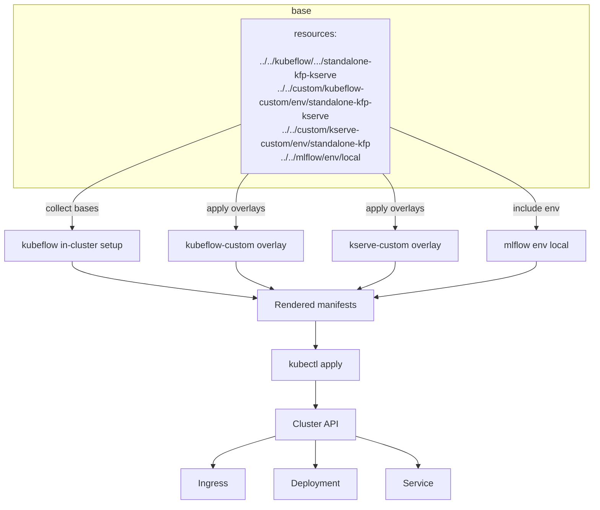

# Guide to Endpoints and Nginx Ingress

This guide explains how external access to platform services is managed via Nginx Ingress Controller and how each major service (Kubeflow, MLflow, Grafana, Prometheus, Minio) is exposed. It references the ingress resources defined in this repository. HTTPS connectivity is also explained here on a higher level as it is handled by the Nginx Ingress Controller. The [https folder](https/) contains more information on the functionality of specific scripts involved in enabling HTTPS connectivity on this platform.


## Nginx role and functionality in the platform cluster

The MLOps platform uses an Nginx Ingress Controller to route external http(s) traffic to internal Kubernetes services as pictured in the Nginx flow overview diagram below. 


#### Traffic flow overview


Nginx Ingress Controller runs as pods in the cluster and watches the Kubernetes API for `Ingress` objects. When you apply or update an Ingress, the controller reconciles configuration and updates its internal Nginx config dynamically.

Ingress objects are applied automatically during the platform install when [`setup.sh`](setup.sh) runs `kustomize build` against the chosen environment under [`deployment/envs/<option>`](deployment/envs/) and then `kubectl apply -f` the rendered manifests. The chosen environment referred here is the same as the ones under [setup.md, deployment options](setup.md#deployment-options). A more detailed explanation of this is process is below in chapter [Kustomize aggregation](#kustomize-aggregation). See also [setup.md](setup.md) for more details of the setup process as a whole. 


## Kustomize aggregation

Kustomize is a Kubernetes-native configuration management tool (integrated part of kubectl, the Kubernetes command-line tool). It lets you customize Kubernetes YAML without copying and modifying the original manifests. Instead of templating, it uses a patch-based and declarative approach. The install aggregates manifests via Kustomize from the selected environment overlay. This process includes the creation of ingress objects which are referred to as resources in the aggregation tree.

The diagram below visualizes the process in the case of [deployment/envs/standalone-kfp-kserve/kustomization.yaml](deployment/envs/standalone-kfp-kserve/kustomization.yaml).

#### Kustomize resource aggregation from base manifests, overlays and environment files; deployment/envs/standalone-kfp-kserve/kustomization.yaml



### How patches and overlays work here

The base manifests are system-agnostic: placeholders like `DOMAIN` and `PLACEHOLDER` keep the repository portable across environments (local kind, cloud, different DNS names/issuers). In other words, bases provide upstream, reusable manifests. Overlays customize those bases for the chosen environment. This composition ensures base manifests stay portable, while env overlays inject the exact values and adjustments needed.

In the case of standalone-kfp-kserve (same as the diagram above), the env file [`deployment/envs/standalone-kfp-kserve/kustomization.yaml`](deployment/envs/standalone-kfp-kserve/kustomization.yaml) aggregates:
  - [`../../kubeflow/manifests/in-cluster-setup/standalone-kfp-kserve`](deployment/kubeflow/manifests/in-cluster-setup/standalone-kfp-kserve/kustomization.yaml) (base Kubeflow + KServe setup).
  - [`../../custom/kubeflow-custom/env/standalone-kfp-kserve`](deployment/custom/kubeflow-custom/env/standalone-kfp-kserve/) (overlay tailoring Kubeflow for this env).
  - [`../../custom/kserve-custom/env/standalone-kfp`](deployment/custom/kserve-custom/env/standalone-kfp/) (overlay tailoring KServe for standalone KFP).
  - [`../../mlflow/env/local`](deployment/mlflow/env/local/) (environment-specific MLflow configs).

These in turn can contain additional resources.

## Path-based routing and rewrites

As the HTTPS request comes from a client browser into the Nginx Ingress Controller, it is sometimes transformed at the ingress in order to reach the requested service and enable the service's internal functions to work correctly.

- Example: Client browser requests `https://DOMAIN/mlpipeline/` → Nginx Ingress Controller receives the request and forwards it to the correct service, kubeflow pipeline, in the cluster as `/`.

These transformations can affect the inner workings of a service/application which can be very application specific. If something isn't working, the ingress rules modifying these are a good place to take a look at. See under the heading [Ingress rules](#ingress-rules) for more details.

## Ingress rules and annotations

Here are some of the rules and annotations used in this project. See also the community [Ingress-NGINX documentation](https://kubernetes.github.io/ingress-nginx/user-guide/nginx-configuration/) for up-to-date details and more instructions on its usage.

Annotations control how the ingress-nginx controller configures Nginx for a given `Ingress`. They add behavior that is not expressed in the base Kubernetes `spec`—for example URL rewrites, authentication, caching, timeouts, CORS, and TLS redirection. Annotations are evaluated by the controller when it renders the Nginx config; when multiple ingresses apply to the same host/path, more specific rules and annotations typically take precedence. Prefer setting annotations on the smallest-scoped `Ingress` that needs the behavior to avoid unintended side effects on other paths. These annotations (`nginx.ingress.kubernetes.io/...`) correspond to the Kubernetes ingress-nginx controller.

- `nginx.ingress.kubernetes.io/rewrite-target: /$2`
  - This removes the `/service` prefix before forwarding to the backend, so a request to `/mlflow/experiments` becomes `/experiments` at the MLflow service.
  - Benefits: Host multiple apps behind a single domain under distinct subpaths without requiring the app to be aware of the prefix.
  - Example translations:
    - `https://DOMAIN/mlpipeline/` → backend request `/`
    - `https://DOMAIN/grafana/dashboards` → backend request `/dashboards`
    - `https://DOMAIN/prometheus/api/v1/query` → backend request `/api/v1/query`
  - Some services like Grafana seem to be prefix-aware and adjust internally to work even without this, but Kubeflow pipelines and mlflow at least seems to need this to be adjusted in the ingress rules.

- `nginx.ingress.kubernetes.io/use-regex: "true"`
  - Enables regex matching for `spec.rules.http.paths[*].path`. When set, the controller treats the path as a PCRE regex and exposes capture groups (e.g., `$1`, `$2`) that can be referenced in `rewrite-target`.
  - Pair with `pathType: ImplementationSpecific` for full regex support. `Prefix` and `Exact` path types do not support regex semantics.
  - Pitfalls: Overly broad patterns can match unintended paths. Anchor patterns appropriately (e.g., `^/service(/|$)(.*)`), and ensure trailing-slash variants are handled.

- `nginx.ingress.kubernetes.io/ssl-redirect: "true"`
  - Forces HTTP traffic to redirect to HTTPS (301/308) for the ingress host/path. Useful to ensure secure transport and consistent URLs.
  - Interaction with controller settings: Some setups enable global SSL redirect; per-ingress annotation allows fine-grained control, including disabling with `"false"` for health endpoints if necessary.
  - Backends may also issue redirects; prefer letting the ingress enforce HTTPS so clients upgrade before reaching the application.

Rules define how requests are matched and routed: each `Ingress` rule combines a `host` with one or more `paths`. A request matches when both host and path conditions are satisfied. `pathType` determines matching semantics—`Prefix` for hierarchical prefixes, `Exact` for strict equality, and `ImplementationSpecific` for controller-defined behavior (regex supported with ingress-nginx). After a match, any active annotations (rewrite, auth, CORS, timeouts) are applied, and the request is proxied to the specified `Service` port. Rewrites change the URI seen by the backend, which is essential when hosting apps under subpaths; ensure the app is configured to generate relative links or respect a base path to avoid broken assets.

- Pattern: `/service(/|$)(.*)`
  - `/service` is the base prefix.
  - `(/|$)` matches either a trailing slash or the end of the path, ensuring both `/service` and `/service/` match.
  - `(.*)` captures the remainder of the request path, which becomes regex group `$2` for rewrite.
    - Needs to have `annotations:
    nginx.ingress.kubernetes.io/use-regex: "true"` for regex to work.
    - During testing, the functionality of this has been questioned as `/service` doesn't seem to always work, even with this enabled.
  

## How HTTPS Works

This platform terminates TLS at the Nginx Ingress Controller. External clients connect over `https://DOMAIN/...`, the ingress presents the TLS certificate, and then proxies traffic to services inside the cluster over plain HTTP.

 Certificate source: Certificates and keys are provided as Kubernetes `Secret` resources referenced by each `Ingress` via the `tls` section. See the detailed steps and options in the [https docs](https/) — for example [`https/Installation_setup.md`](https/Installation_setup.md), [`https/SSL_Creation_guide.md`](https/SSL_Creation_guide.md), and [`https/Creating_ssl_certificate.md`](https/Creating_ssl_certificate.md).
 
 DNS and hostnames: The `DOMAIN` placeholder in manifests must resolve to the ingress controller’s public IP. Update your DNS A/AAAA records accordingly. The same `DOMAIN` is used in all `Ingress` hosts to serve multiple apps under path prefixes (`/mlpipeline`, `/mlflow`, etc.).

TLS termination: Nginx Ingress uses the certificate from the `Secret` to terminate HTTPS and forward to backend services. Backends typically listen on HTTP (e.g., `mlflow:5000`, `grafana:3000`).

 HTTP→HTTPS redirect: You can enforce HTTPS by setting `nginx.ingress.kubernetes.io/ssl-redirect: "true"` on ingresses. Some environments enable global redirect at the controller level.

 Self-signed vs CA: For local/testing, a self-signed certificate can be created using the script [`scripts/SSL_Creation.sh`](scripts/SSL_Creation.sh) and the [https guides](https/). For production, obtain certificates from a trusted CA. If you use your own CA, distribute the CA certificate to client machines/browsers (see [`https/Certificate_authority.md`](https/Certificate_authority.md)).
- Secret management: Store certs as `tls` secrets in the relevant namespace. Example:

```yaml
apiVersion: networking.k8s.io/v1
kind: Ingress
metadata:
  name: mlflow-ingress
  annotations:
    nginx.ingress.kubernetes.io/ssl-redirect: "true"
spec:
  tls:
  - hosts:
    - DOMAIN
    secretName: domain-tls-secret
  rules:
  - host: DOMAIN
    http:
      paths:
      - path: /mlflow(/|$)(.*)
        pathType: ImplementationSpecific
        backend:
          service:
            name: mlflow
            port:
              number: 5000
```

Troubleshooting tips:
- Certificate not trusted: Verify the certificate chain and that `DOMAIN` matches the certificate’s Common Name/SANs. This issue is common when using Let's Encrypt production environment. See Let's Encrypt rate limits at https://letsencrypt.org/docs/rate-limits/ for more details and consider using their staging environment: https://letsencrypt.org/docs/staging-environment/.
- Mixed content or redirects: Check rewrite rules and app base URLs (e.g., Grafana `root_url`) to ensure subpath hosting works over HTTPS.
- Wrong secret namespace: The `tls` secret must exist in the same namespace as the `Ingress`.
- Host mismatch: The browser `Host` must match the `Ingress` `spec.rules.host` and `spec.tls.hosts` entry.

## Platform endpoint information and current status

Here are some of the services, their endpoints and ingresses used in this platform. The rules such as described in [Ingress rules](#ingress-rules) can be modified in these ingress files. See [How patches and overlays work here](#how-patches-and-overlays-work-here) for why NOT to change the placeholders in the ingress files directly and how they are updated automatically.

### Kubeflow, [ml-pipeline-ui-ingress.yaml](deployment/kubeflow/manifests/apps/pipeline/upstream/base/pipeline/ml-pipeline-ui-ingress.yaml)

- This service can be found at endpoint /mlpipeline/
- Tested to be accessible via remote browser https connection. However, there is an issue with executions tab: `Error: Failed getting executions: Unknown Content-type received.. Code: 2`
- demo-run/wine-quality demo run through jupyter notebook shows up via browser

### Mlflow, [mlflow-ingress.yaml](deployment/mlflow/base/mlflow-ingress.yaml)

- This service can be found at endpoint /mlflow/
- All the tabs seem to be working properly when accessed via browser and https but not much else has been tested

### Grafana, [grafana-ingress.yaml](deployment/monitoring/grafana/grafana-ingress.yaml)

- This service can be found at endpoint /grafana/ but redirects to grafana/login
- This service has not been tested otherwise
- Works with `/grafana` without trailing slash as well. Grafana is often prefix-aware and can be configured via `root_url` to handle subpaths even without rewrite rules.

### Prometheus, [prometheus-ingress.yaml](deployment/monitoring/prometheus/prometheus-ingress.yaml)

- /prometheus redirects to /graph which doesn't lead anywhere
- No additional testing done

### Minio, [minio-ingress.yaml](deployment/mlflow/minio/minio-ingress.yaml)

- No tests done for this endpoint